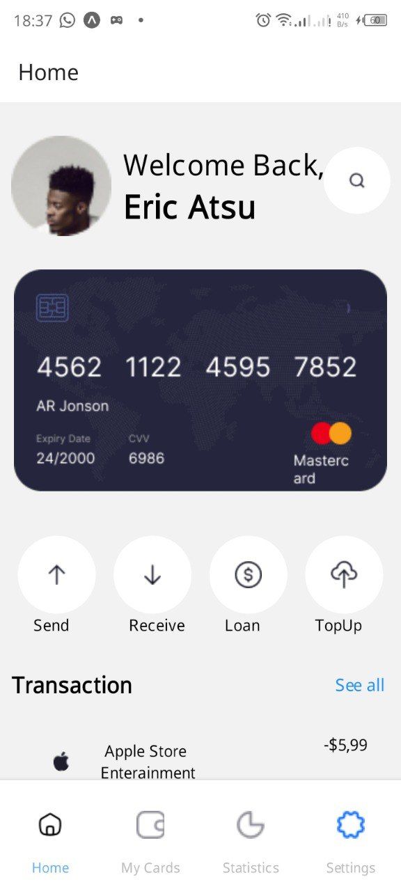
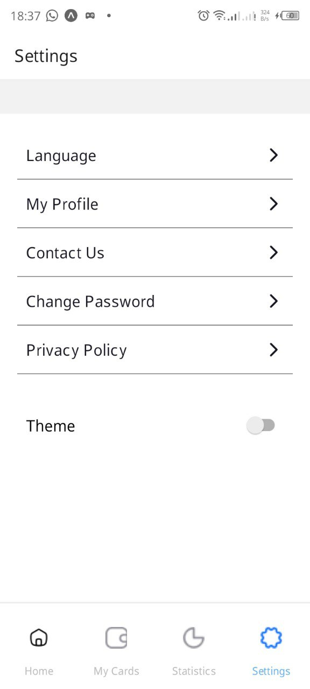
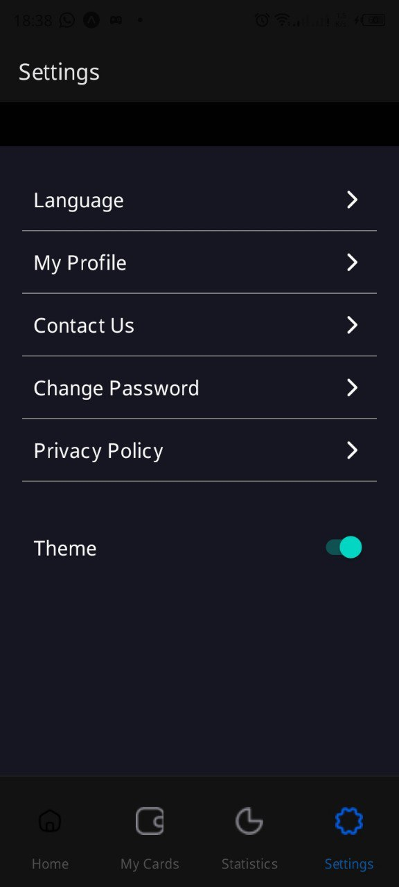
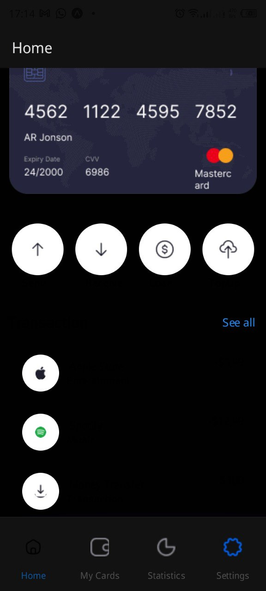

# RN-ASSIGNMENT-11150578

This project consists of two main components: Dashboard and Settings.

## Key Features

- Dynamic theme switching between light and dark modes
- Persistent theme selection using AsyncStorage
- Custom navigation with themed bottom tabs
- Responsive UI elements that adapt to the selected theme
- Transaction list with themed card views

## Technical Highlights

- Built with React Native
- Uses React Navigation for routing
- Implements Context API for global theme management
- Utilizes AsyncStorage for local data persistence
- Custom components for reusable UI elements

## Getting Started

1. Clone the repository
2. Install dependencies with `npm install` or `yarn install`
3. Run the app with `npx react-native run-android` or `npx react-native run-ios`

## Usage

Navigate through the app using the bottom tab bar. To toggle between light and dark modes, go to the Settings screen and use the theme switch.

## Screenshots

